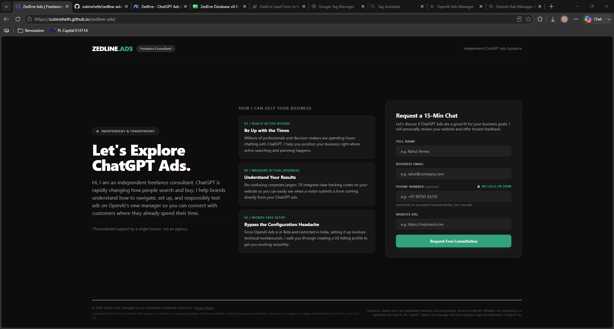
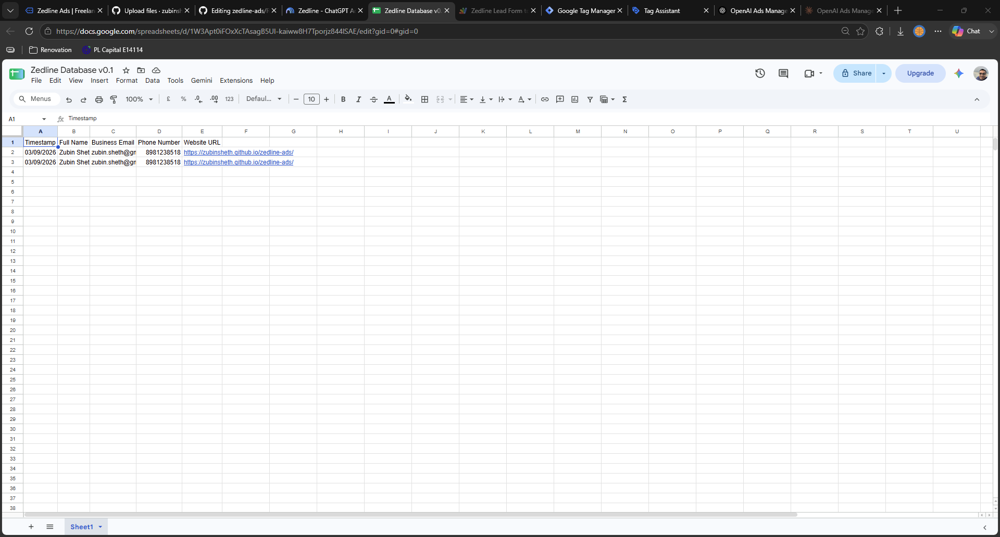
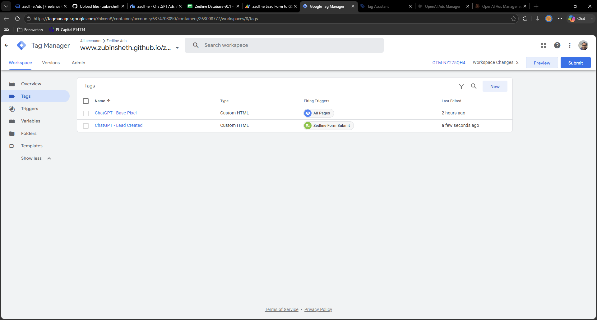
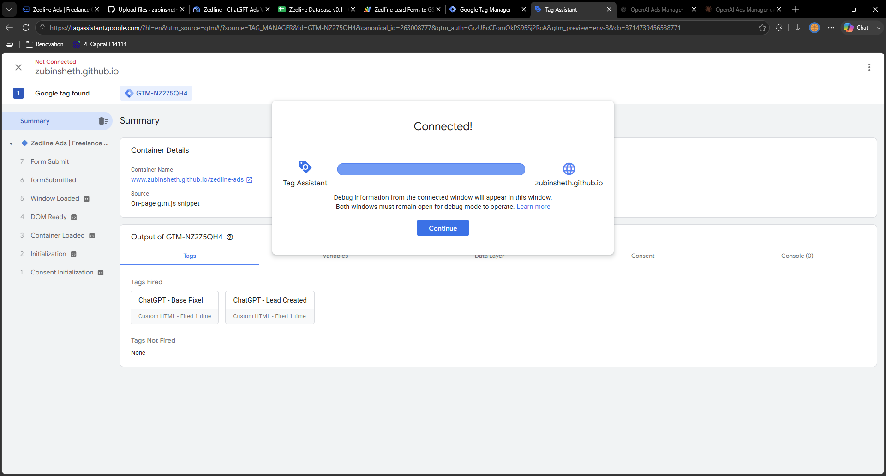
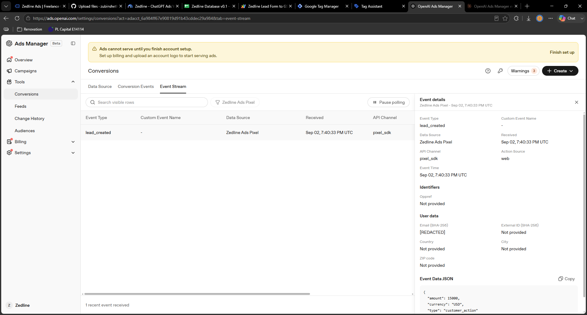

# Zedline Ads | Freelance ChatGPT Ads Consulting Landing Page

A fast-loading, highly-optimized, single-screen landing page built for an independent freelance consultant helping brands navigate, set up, and responsibly test conversational search campaigns on **OpenAI Ads Manager**.

Designed with an elegant, **ChatGPT Obsidian-inspired aesthetic** (Deep Dark mode with emerald-green accents), this repository provides a high-converting, low-friction, mobile-responsive layout and a secure lead-generation pipeline that connects directly to Google Sheets without complex server-side databases.

---

## 🚀 Features

*   **100% Single-Screen Viewport**: On desktop, the page fits entirely in a single view with zero scrolling, splitting into a neat, three-column asymmetric grid. It gracefully collapses into a stacked mobile layout.
*   **Decoupled Configuration (`config.js`)**: Keep your personal tracking IDs and webhook URLs completely separate from the design code. You can update your copy or layout in `index.html` at any time without having to re-paste your integration keys.
*   **Low-Friction Interactive Form**: We've removed standard barriers to conversion. The phone number field is optional and has a clear privacy security badge: `🔒 No Calls or Spam`, reassuring visitors that data is used strictly for encrypted ad matching.
*   **Micro-Interactive UI**: The submission button instantly disables and shows a spinning loading indicator on click. Once the webhook confirms receipt, the form smoothly animates into a custom-drawn SVG checkmark.
*   **Honest & Transparent Copywriting**: Positions your service cleanly as a dedicated single-person freelance consultant offering high-value advisory, compliant US account bypasses, and conversational context hints audits.

---

## 📂 Project Structure

```bash
├── index.html        # The main landing page file (HTML, CSS, JavaScript, GTM triggers)
├── config.js         # The local configuration file containing your unique API keys & Webhook URLs
└── README.md         # Project documentation and deployment guide
```

---


## 🧠 AI Product Management Thinking

This section highlights the critical **product management** and **systems-thinking** frameworks applied during the architecture, design, and integration of the Zedline Ads conversion pipeline.

### 1. Friction vs. Attribution Optimization (Advanced Matching)
*   **The Challenge**: User acquisition campaigns suffer massive conversion drop-offs when forms demand sensitive personal information early in the funnel. However, modern advertising networks rely on detailed first-party identifiers (like names, emails, and phone numbers) to successfully match users and fuel algorithmic machine learning models.
*   **The PM Resolution**: The phone number field was made completely **optional**, paired with a prominent trust badge: `🔒 No Calls or Spam`. The system educates the user that data is used strictly for encrypted background matching to identify their active ChatGPT accounts [13]. This transparent, privacy-first explanation eliminates cold-calling anxiety while preserving high-fidelity attribution for the ad network.
*   **Attribution Balance**: Standardizing the submission process to immediately hash first-party data securely on the browser (via client-side SHA-256) ensures the business respects privacy compliance while optimizing ad matching performance [13].

### 2. Algorithmic Feedback Loops (Preventing Selection Bias)
*   **The Challenge**: Direct-response marketing campaigns are prone to machine learning feedback loops where ad platforms display ads strictly to profiles cloned from existing converters. This introduces severe *Selection Bias*—such as targeting only a specific demographic or device group because they happened to convert first, while ignoring segments with higher relative click-to-conversion probabilities.
*   **The PM Resolution**: Engineered explicit page-tracking hooks. By configuring GTM to fire base pixel loads (`PageView`) as well as conversion events (`lead_created`) [14, 16], OpenAI's **"Maximize Results"** bidding engine is fed a clean, complete mathematical conversion ratio [12]. This allows the AI to calculate actual probability distributions and dynamically filter out low-intent curiosity clicks, protecting your test budget [24].

### 3. Decoupled and Scalable System Architecture
*   **The Challenge**: Static web environments often bake platform-specific tracking scripts directly into the page's HTML file. When marketing managers or copywriters adjust text or headers in `index.html`, they run the risk of breaking live javascript functions and GTM data layers.
*   **The PM Resolution**: Designed a fully decoupled architecture to isolate design from core data engineering:
    *   **Google Tag Manager (GTM)** acts as our centralized cloud switchboard [14]. Platform pixels (OpenAI, Meta, or Google Analytics) are managed and triggered externally, leaving the page clean and light.
    *   An external configuration file (`config.js`) hosts all static variable identifiers (such as the GTM container ID and Google Script URL). Marketing teams can blindly iterate or replace the `index.html` layout file during A/B tests with zero risk of breaking integrations.

### 4. Zero-Database Serverless MVP Design
*   **The Challenge**: Building custom backends with relational databases (SQL, Postgres) creates structural latency, security overhead, and ongoing hosting costs—highly inefficient for a freelance MVP validation test.
*   **The PM Resolution**: Designed a lightweight, serverless webhook utilizing Google Apps Script. Form dispatches are URL-encoded (`URLSearchParams`) and posted securely to a Google Sheet. This provides a zero-maintenance, zero-cost datastore that updates in real-time, delivering a simple, accessible lead pipeline for immediate client outreach.

---

## 📸 Product Interface & Verification

These visual touchpoints showcase the operational mechanics of the pipeline—connecting front-end user experience to back-end marketing infrastructure.

### 1. Premium Obsidian UI (Frontend Experience)
Designed to mirror OpenAI's ChatGPT visual guidelines. Built with an asymmetric grid layout, fitting 100% on a single screen (on desktop) to maximize focus and drive visual authority.


### 2. Micro-Interactive Submission Loop & Google Sheet Datastore
The moment a visitor submits a request, the CTA button dynamically disables and displays an active loading spinner to prevent double-submissions. Upon a successful webhook return, the form scales down to reveal an animated, self-drawing green checkmark.


### 3. GTM Tag Switchboard (Platform Middleplane)
Shows how Google Tag Manager triggers the OpenAI Base Pixel across all page view baselines, while dynamically passing a clean, budget-free conversion signal (`lead_created`) strictly on verified submissions [14, 16].



### 4. OpenAI Ads Manager Event Stream (Backend Verification)
Our conversion code has been rigorously validated using OpenAI's active **Event Stream Polling** tool [18]. It confirms GTM transmits conversion signals in a clean, 1-to-1 pattern (no duplicate events on page refreshes), enabling accurate algorithmic training [18].


---


## 🛠️ Installation & Setup

Deploying this project requires a simple 4-step setup.

### Step 1: Create Your Private Google Sheet Webhook

Your website form sends leads directly to a private Google Sheet using a lightweight, domain-secured **Google Apps Script** as a serverless webhook.

1. Open a blank **Google Sheet** where you wish to save your incoming leads.
2. Label the columns in Row 1 sequentially from left to right:
   *   **Column A**: `Timestamp`
   *   **Column B**: `Full Name`
   *   **Column C**: `Business Email`
   *   **Column D**: `Phone Number`
   *   **Column E**: `Website URL`
3. Click **Extensions > Apps Script** from the top menu.
4. Replace the default placeholder code in the editor with the following script:

```javascript
/**
 * Secure Google Sheets Webhook with Domain Locking (Approach B)
 * Saves incoming landing page lead forms safely to your Google Sheet.
 */
function doPost(e) {
  // ================= SECURITY LOCK =================
  // Replace this with your exact live GitHub Pages domain URL (no trailing slash)
  // e.g., "https://yourusername.github.io"
  // For local testing (file:///), you can temporarily set this to "*" or comment it out.
  var allowedOrigin = "https://yourusername.github.io"; 
  
  // Extract origin domain from the payload
  var requestOrigin = e.parameter.origin || "";
  
  // Reject request if the domain origin does not match
  if (allowedOrigin !== "*" && requestOrigin !== allowedOrigin) {
    return ContentService.createTextOutput(JSON.stringify({ 
      "status": "error", 
      "message": "Access Denied: Unauthorized origin domain." 
    })).setMimeType(ContentService.MimeType.JSON);
  }
  // =================================================

  try {
    var sheet = SpreadsheetApp.getActiveSpreadsheet().getActiveSheet();
    
    // Extract parameters passed from the landing page
    var timestamp = new Date();
    var name = e.parameter.name || "N/A";
    var email = e.parameter.email || "N/A";
    var phone = e.parameter.phone || "Not Provided";
    var website = e.parameter.website || "N/A";
    
    // Append rows sequentially to match your columns
    sheet.appendRow([timestamp, name, email, phone, website]);
    
    return ContentService.createTextOutput(JSON.stringify({ 
      "status": "success", 
      "message": "Lead captured successfully!" 
    })).setMimeType(ContentService.MimeType.JSON);
    
  } catch (error) {
    return ContentService.createTextOutput(JSON.stringify({ 
      "status": "error", 
      "message": error.toString() 
    })).setMimeType(ContentService.MimeType.JSON);
  }
}
```

5. Click the **Save** (floppy disk) icon.
6. Click **Run** once to authorize permissions for the sheet (a pop-up will ask you to select your Google Account, click **Advanced**, click **Go to Untitled Project (unsafe)**, and select **Allow**).
7. Click **Deploy > New Deployment** in the top right.
8. Choose **Web App** as the type:
   *   **Execute as**: *Me (your email)*
   *   **Who has access**: *Anyone* (This is required so your public landing page can write to the sheet).
9. Click **Deploy** and copy your **Web App URL** (it will end with `/exec`).

---

### Step 2: Configure the Global `config.js` File

Create a file named **`config.js`** in the root of your repository and paste the following template. Fill in your actual IDs and webhook URL:

```javascript
/**
 * Zedline Ads - Global Configuration File
 * Set your keys here once. index.html will dynamically read them on page load.
 */
window.ZEDLINE_CONFIG = {
  gtmId: "GTM-XXXXXXX", // Replace with your actual Google Tag Manager container ID
  webhookUrl: "https://script.google.com/macros/s/YOUR_DEPLOYMENT_ID/exec" // Paste your Google Apps Script URL here
};
```

*Note: By keeping these keys inside `config.js`, you can completely replace `index.html` in the future with copywriting edits without having to re-insert your tracking IDs!*

---

### Step 3: Google Tag Manager Integration

To send clear conversion parameters back to OpenAI's Ads Manager without inflating fake ad budget metrics, configure your GTM workspace with two specific tags:

#### 1. The Base Pixel Tag
*   **Tag Type**: Custom HTML
*   **Tag Name**: `ChatGPT - Base Pixel`
*   **Code**: Copy the base JavaScript code generated under your Web Data Source in OpenAI Ads Manager.
*   **Triggering**: *All Pages*

#### 2. The Lead Created Event Tag
*   **Tag Type**: Custom HTML
*   **Tag Name**: `ChatGPT - Lead Created`
*   **Triggering**: Trigger on your standard form submission event (`formSubmitted`).
*   **Code**: Paste the following streamlined script that transmits a clean conversion signal to OpenAI with built-in deduplication:

```html
<!-- OpenAI Lead Created Event Tag (Clean Conversion Tracking) -->
<script>
  (function() {
    oaiq('measure', 'lead_created', 
      {
        type: 'customer_action'
      },
      {
        event_id: 'lead_' + new Date().getTime() // Secure deduplication ID matching form submit timestamp
      }
    );
  })();
</script>
```

---

### Step 4: Deploy to GitHub Pages

1. Push `index.html` and your configured `config.js` files to a public or private GitHub repository.
2. In your GitHub repository, click **Settings > Pages** in the left-hand sidebar.
3. Under **Build and deployment**, set the source to **Deploy from a branch**.
4. Select your branch (usually `main`) and set the folder to `/ (root)`. Click **Save**.
5. Within 1-2 minutes, GitHub will generate your live website link (e.g., `https://yourusername.github.io/zedline-ads/`).
6. Update the `allowedOrigin` domain inside your Google Apps Script to match this exact URL to activate your security lock.

---

## 🔒 Security & Privacy Notice

*   **Automatic Advanced Matching**: First-party data metrics (such as names, emails, and phone numbers) are processed through automatic client-side hashing (SHA-256 encryption) before reaching OpenAI. 
*   **Independent Initiative**: This consulting asset is an independent freelance project and is not officially affiliated with, endorsed by, or partnered with OpenAI, Inc.
*   **Beta Platform Notice**: OpenAI Ads Manager is currently in a beta-testing phase. Platform availability, bidding features, and ad delivery structures are subject to changes beyond external control.
